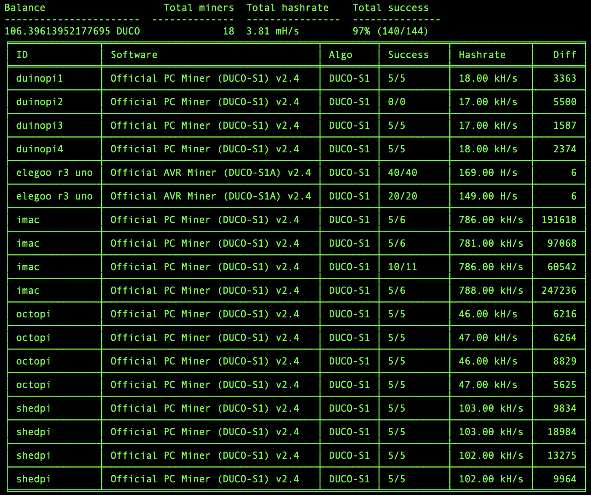

# duco-miners

duco-miners is a super simple terminal "dashboard" for you to view a list of your Duino Coin miners. The output automatically updates every 15 seconds and provides you with a break down of each of your miners (in alphabetical order) as well as an overview of all of your miners and your current balance.

PLEASE NOTE: The "Daily profit" will differ to what you see on the Web and Desktop Wallets as they use different refresh rates!! 

## Usage

1. Clone this repo
1. Open up a terminal and `cd` into the repo directory
1. Run `pip3 install -r requirements.txt`
1. Once all of the dependencies have been installed run `python3 miners.py`
1. Enter in your DUCO username. 

## Extra

Feel free to fork and edit this as you see fit. 

If you like this and would like to donate some DUCO to me, my wallet username is `dansinclair25`.
